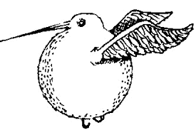

Snidget - idiomatic and smart php microframework

# What is a "Snidget" ?

The Golden Snidget was a small golden magical bird with fully rotational wings,  
best known for early use in the wizarding game of Quidditch, eventually being replaced by the Golden Snitch

# Features

- php 8 features
- flexible system of modules
- best practices for scalable architectures (DDD + CQRS)
- full compatible with "12-factor app" concept
- thoughtful api architecture from the box
- compatibility with PSR
- advanced code generation
- encourages the use of effective algorithms and patterns

# Roadmap

- support using git in container (already installed - need only in dev!)
- composer.json link to bin? need run all 'scripts' without `cd`
- set prod environment (for example, vendor dir its read-only volume, data its optional)
- create interface for Driver and Module?
